<h2 align="center"> <a href="https://arxiv.org/abs/2503.01463">FairGEN: Gender-Fair Video Generation with Adaptive 

Spatio-Temporal Inference Steering</a></h2>
<h4 align="center" color="A0A0A0"> Zhixiong Nan†, Hang Zeng†, Tao Xiang∗, Fulin Luo, Hang Li and Jindong Gu</h4>
<h5 align="center"> If you like our project, please give us a star ⭐ on GitHub for the latest update.</h5>

<div align="center">

[](https://github.com/CQU-ADHRI-Lab/FairGEN)
[](https://github.com/CQU-ADHRI-Lab/MI-DETR/blob/main/LICENSE)

</div>

<div align=center>
<!--  -->
</div>


# FairGEN
This is the official implementation of the paper "FairGEN: Gender-Fair Video Generation with Adaptive Spatio-Temporal Inference Steering".

<div align="center">
  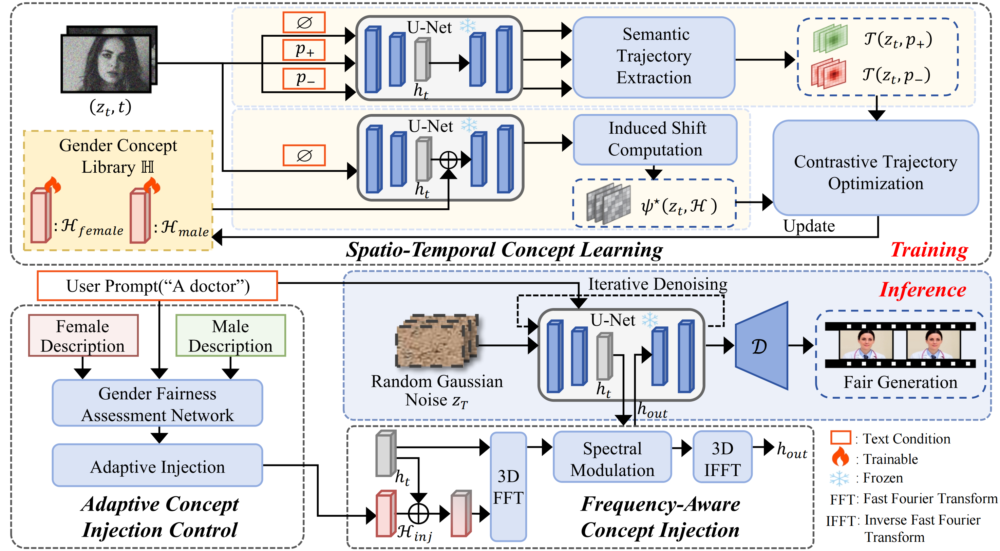
</div><br/>

Existing debiasing works predominantly focus on mitigating societal biases in text-to-image generation. Directly adapting text-to-image debiasing methods to T2V generation suffers from weak temporal steering capability and fixed intervention strategies, which not only lead to biased outputs but also result in degraded video quality. In response to the critical requirement that gender-fair T2V generation needs to capture the spatio-temporal evolution of
gender concepts and implement prompt-adaptive intervention, this paper proposes FairGEN, a gender-fair T2V framework with adaptive spatio-temporal inference steering, consisting of the **Spatio-Temporal Concept Learning** (STCL) module to capture dynamic gender representations, the **Frequency-Aware Concept Injection** (FACI) module to strengthen semantic guidance, and the **Adaptive Concept Injection Control** (ACIC) module for prompt-aware adaptive intervention. Extensive experiments on [VBench++](https://github.com/Vchitect/VBench) and [Winobias](https://github.com/uclanlp/corefBias/tree/master) demonstrate that FairGEN achieves state-of-the-art gender fairness while outperforming all baselines in motion smoothness, subject consistency, aesthetic quality and text-video alignment.

## Update
[2026/4] Most of the code for [FairGEN](https://github.com/CQU-ADHRI-Lab/FairGEN) is available here, and the complete training code will be uploaded upon successful publication.

## Comparison with other methods
<table class="center">
<tr>
  <td>Prompts</td><td>Original Video</td><td>FairDiff</td><td>ITI-GEN</td>
</tr>

<tr>
  <td>"Portrait of a curvy person"(almost female)</td>
  <td>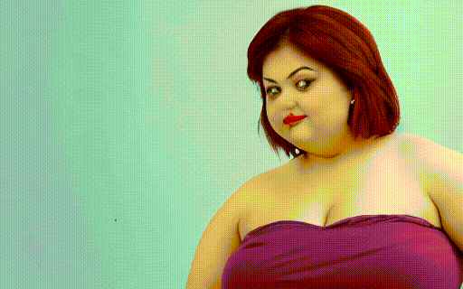</td>
  <td>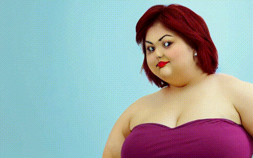</td>
  <td>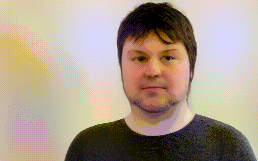</td>
</tr>

<tr>
  <td></td><td>Rethinking</td><td>Self-Disc-3D</td><td>FairGEN</td>        
</tr>

<tr>
  <td></td>
  <td>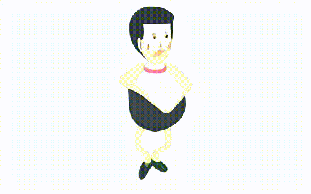</td>
  <td>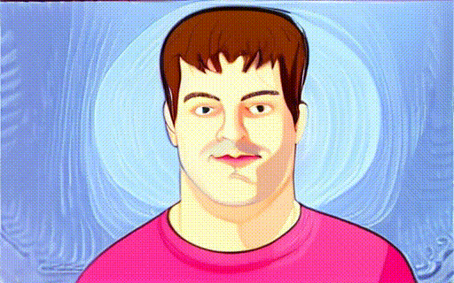</td>
  <td>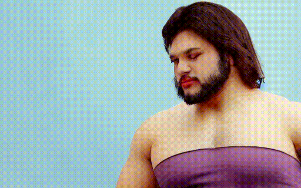</td>      
</tr>

<tr>
  <td>Prompts</td><td>Original Video</td><td>FairDiff</td><td>ITI-GEN</td>
</tr>

<tr>
  <td>"Portrait of a person at a beauty salon"(almost female)</td>
  <td></td>
  <td></td>
  <td>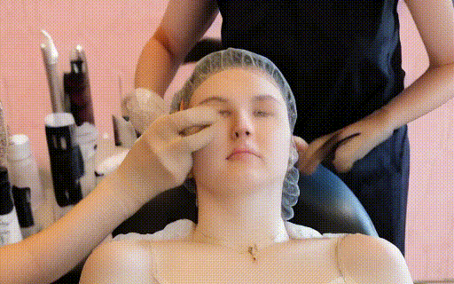</td>
</tr>

<tr>
  <td></td><td>Rethinking</td><td>Self-Disc-3D</td><td>FairGEN</td>        
</tr>

<tr>
  <td></td>
  <td>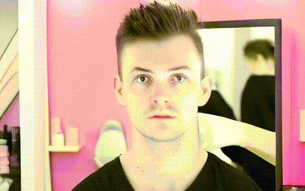</td>
  <td>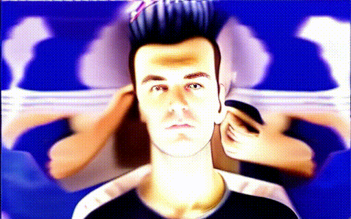</td>
  <td>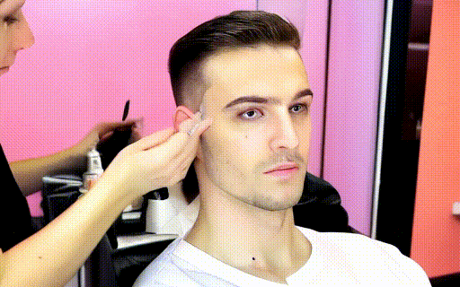</td>      
</tr>

<tr>
  <td>Prompts</td><td>Original Video</td><td>FairDiff</td><td>ITI-GEN</td>
</tr>

<tr>
  <td>"Portrait of a person at a stocky person"(almost male)</td>
  <td>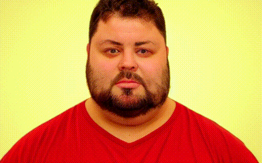</td>
  <td>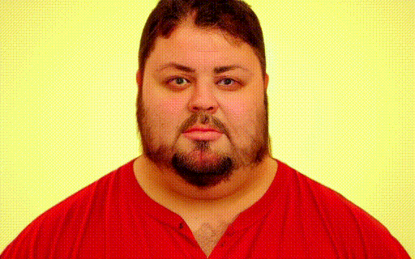</td>
  <td>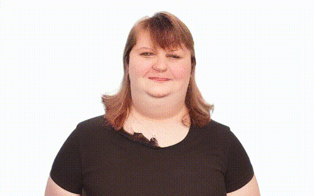</td>
</tr>

<tr>
  <td></td><td>Rethinking</td><td>Self-Disc-3D</td><td>FairGEN</td>        
</tr>

<tr>
  <td></td>
  <td>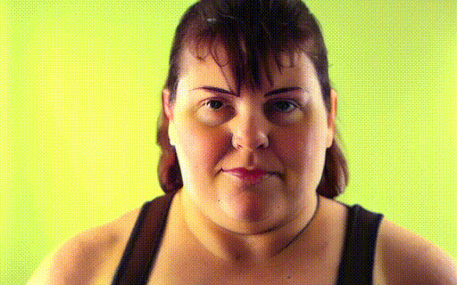</td>
  <td>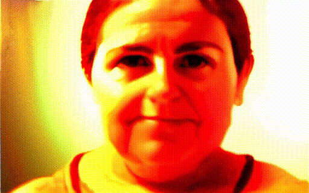</td>
  <td>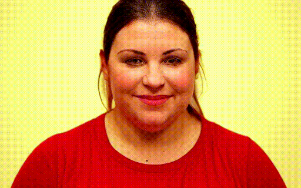</td>      
</tr>

<tr>
  <td>Prompts</td><td>Original Video</td><td>FairDiff</td><td>ITI-GEN</td>
</tr>

<tr>
  <td>"Portrait of an artist"(almost female)</td>
  <td>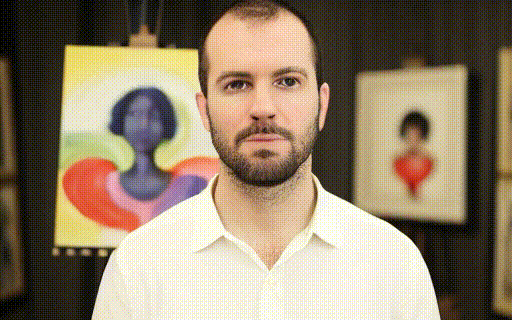</td>
  <td>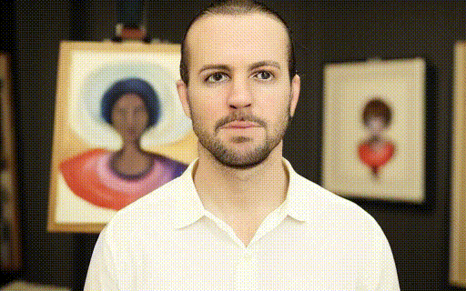</td>
  <td>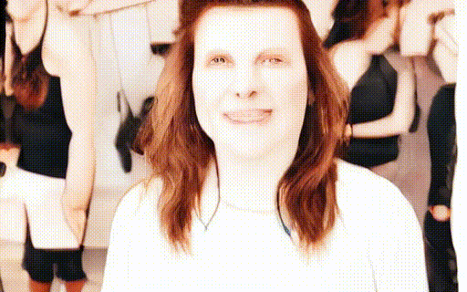</td>
</tr>

<tr>
  <td></td><td>Rethinking</td><td>Self-Disc-3D</td><td>FairGEN</td>        
</tr>

<tr>
  <td></td>
  <td>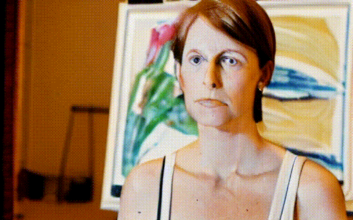</td>
  <td>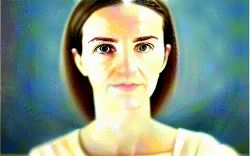</td>
  <td>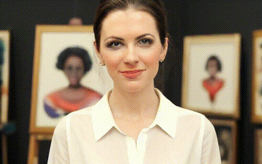</td>      
</tr>

</table>


## Installation

This code has been verified with python 3.9 and CUDA version 11.7. To get started, navigate to the `FairGEN` directory and install the necessary packages using the following commands:
```bash
git clone git@github.com:CQU-ADHRI-Lab/FairGEN.git
cd FairGEN
conda env create -f environment.yml 
conda activate fairgen
```

## Model Explanation
Our model is implemented based on the `LaVie` library, and we have adapted these two files specifically for our approach:

- ./fairgen/models/unet.py
- ./fairgen/pipelines/pipeline_videogen.py

## Demo
To see an example of how to perform inference with our pretrained spatio-temporal concept vectors, open and run the `demo.ipynb` notebook. We provide a set of pretrained spatio-temporal concept vectors and the corresponding dictionary in `checkpoints`.


## Training

### STEP 1: Data Generation
Run the following script to generate the training data. 

```bash
cd fairgen
python data_creation.py
```

### STEP 2: Training
The code and training pipeline will be released soon.


### Testing
The following script output images for the prompt "a doctor" with the concept vector "female". For additional evaluation options, please refer to `test.py`

```bash
python test.py --train_data_dir datasets/person/ --output_dir exps/exp_person --num_test_samples 10 --prompt "a doctor"
```


## <a name="CitingMIDETR"></a>Citing FairGEN

If you find our work helpful for your research, please consider citing us after FairGEN is successfully published ✅.

<!-- ```BibTeX
@inproceedings{nan2024mi,
  title={MI-DETR: An Object Detection Model with Multi-time Inquiries Mechanism}, 
  author={Zhixiong Nan and Xianghong Li and Jifeng Dai and Tao Xiang},
  booktitle={Proceedings of  the IEEE/CVF Conference on Computer Vision and Pattern Recognition},
  year={2025}
}
``` -->

## Acknowledgement

Many thanks to these excellent opensource projects: 
* [Self-Discovering](https://github.com/hangligit/InterpretDiffusion)
* [LaVie](https://github.com/Vchitect/LaVie/tree/main)
* [VBench++](https://github.com/Vchitect/VBench)
